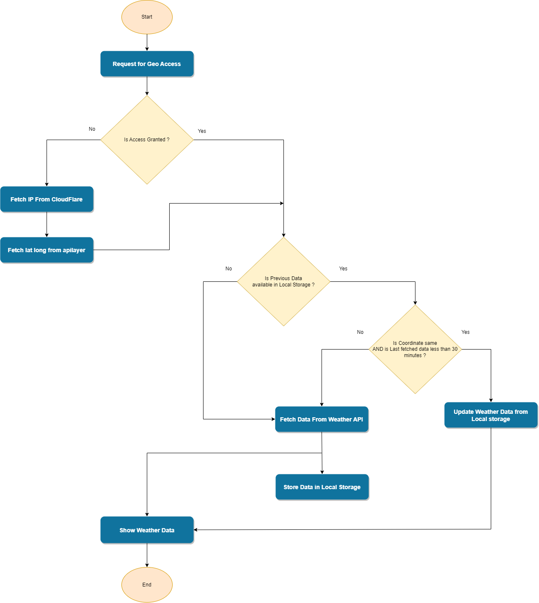

# vue-weather-app

## How to run

```sh
npm install
npm run lint
npm run dev
```

## Component hierarchy

1. src
   - assets
     - style.scss (global css)
   - components
     - MainComponent.vue (main app component)
   - utils
     - index.js (helper functions)
   - App.vue (contain full app)

## app data flow diagram


